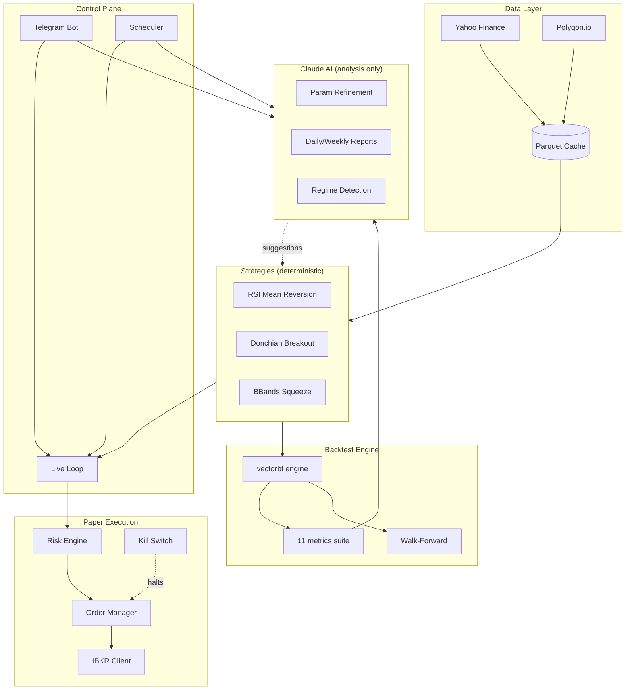

# AI Trading Research Lab

> Paper-only trading research platform combining deterministic Python strategies, Claude-powered analysis, and Interactive Brokers paper execution. Built to study mean reversion, trend following, and volatility breakout regimes in equity markets — safely.

[](https://www.python.org)
[](http://mypy-lang.org/)
[](#testing)
[](LICENSE)
[](#safety)

---

## What this is

A research-grade backtesting and paper-trading system that:

- **Runs three quantitative strategies** across mean reversion, trend following, and volatility breakout regimes.
- **Backtests with realistic costs** — basis-point commission and slippage, Wilder-smoothed indicators, walk-forward out-of-sample validation.
- **Uses Claude for analysis, not for trading decisions** — strategy refinement, regime detection, and post-trade reports. Order execution is fully deterministic.
- **Executes on IBKR paper accounts only** — multi-layer safety enforcement makes a live-account misfire structurally impossible.
- **Controlled via Telegram** — kill switch, status queries, on-demand backtests, scheduled reports.

This is a **portfolio project** demonstrating production patterns for financial automation: type-safe Python, audited LLM calls, structural safety guards, walk-forward optimization, and async live loops.

---

## Sample backtest results

Real backtests on SPY, 2020-01-01 → 2024-12-31, 1bp commission + 2bp slippage, no leverage:

| Strategy | Trades | Total Return | Sharpe | Max Drawdown | Win Rate | vs Buy & Hold |
|---|---:|---:|---:|---:|---:|---:|
| **Donchian Breakout** | 13 | +22.4% | 0.73 | -9.1% | 54% | -0.3pp |
| **RSI Mean Reversion** | 5 | +1.4% | 0.11 | -8.8% | 60% | -21.3pp |
| **BBands Squeeze** | 6 | -1.9% | -0.12 | -8.9% | 33% | -24.6pp |

**Reading the results:** Donchian captured the 2020-2024 trend regime, keeping pace with buy-and-hold at a third of the time in market. The mean reversion and squeeze strategies underperformed during this period — exactly the regime mismatch that motivates the Claude-driven regime detection layer.

> **No strategy here is meant to be profitable in production.** The point is the infrastructure: deterministic signals, validated execution, audited LLM calls, full walk-forward validation, and structural safety.

---

## Architecture



---

## Safety

Trading systems that touch live brokerage accounts must be **structurally** safe, not just intentionally safe. The repo enforces these guarantees:

| Guarantee | Enforcement |
|---|---|
| Paper account only | Config rejects IBKR port `7496` (live TWS) at validation time, before client construction. |
| Verified account ID | Config rejects account IDs that don't start with `D` (IBKR's paper-account prefix). |
| Position sizing cap | Order manager rejects any single order > 5% of paper NAV. |
| Daily drawdown kill switch | If realized + unrealized PnL drops below threshold, all open orders cancel and new entries halt until manually reset via Telegram `/reset_killswitch`. |
| Trading hours guard | Orders outside US regular hours are rejected at validation. |
| Idempotency | Each strategy tick produces 0 or 1 signal; signal-to-order conversion uses `(strategy_id, symbol, bar_timestamp)` as a unique key. |
| Claude never trades | LLM module has no function-calling tool that touches IBKR. Returns structured JSON only; deterministic code validates and acts. |

These are not documentation promises — they are **code paths verified by tests**.

```bash
# Verify the live-port guard:
$ IBKR_PORT=7496 uv run python -c "from trading_lab.config import Settings; Settings()"
ValidationError: IBKR_PORT 7496 is the live TWS port and is blocked by policy
```

---

## Quick start

Requires Python 3.13 and [`uv`](https://github.com/astral-sh/uv).

```bash
# 1. Clone and enter
git clone https://github.com/datAgent77/ai-trading-research-lab.git
cd ai-trading-research-lab

# 2. Install dependencies
uv sync

# 3. Copy environment template
cp .env.example .env
# Edit .env: add ANTHROPIC_API_KEY, IBKR_ACCOUNT (must start with D), TELEGRAM_BOT_TOKEN

# 4. Run a backtest
uv run python scripts/run_backtest.py donchian SPY --start 2020-01-01 --end 2024-12-31

# 5. Run walk-forward optimization
uv run python scripts/run_walk_forward.py rsi SPY --start 2018-01-01 --end 2024-12-31

# 6. Run tests
uv run pytest -v
```

For paper trading and Telegram bot setup, see [docs/ARCHITECTURE.md](docs/ARCHITECTURE.md) and [docs/SAFETY.md](docs/SAFETY.md).

---

## Strategies

Three strategies are implemented as concrete subclasses of `Strategy`. Each is long-only initially, with explicit entry/exit logic and parameter validation at construction time.

### RSI Mean Reversion
- **Idea:** Buy oversold reversals; markets overshoot and mean-revert.
- **Entry:** RSI(14) crosses up through 30.
- **Exit:** RSI > 50 (target) or ATR(14)-based stop loss.
- **Smoothing:** Wilder's RMA (industry standard, not SMA).
- **Best regime:** Range-bound or oversold rebound markets.

### Donchian Breakout
- **Idea:** Markets trend after breaking out of consolidation ranges (Turtle Trader school).
- **Entry:** Close > 20-day high.
- **Exit:** Close < 10-day low.
- **Best regime:** Sustained directional trends.

### BBands Squeeze
- **Idea:** Volatility compression (BB inside Keltner) precedes directional expansion.
- **Entry:** Squeeze release with close above SMA(20).
- **Exit:** Close drops back below SMA(20).
- **Best regime:** Post-consolidation breakouts.

Each strategy validates its parameters at instantiation, returns a deterministic `pd.Series` of `{-1, 0, +1}` signals, and is fully tested in `tests/unit/test_strategies.py`.

---

## Tech stack

| Layer | Choice | Why |
|---|---|---|
| Language | Python 3.13 | Modern typing, structural pattern matching |
| Package manager | `uv` | Fast, reproducible, locks the dev group |
| Backtest engine | `vectorbt` | Vectorized, fast, realistic cost modeling |
| Live execution | `ib_insync` | Async IBKR API wrapper |
| Market data | `yfinance` + `polygon-api-client` | Free start, paid upgrade path |
| Database | SQLite (Postgres-ready) | Schema works for both |
| AI layer | `anthropic` SDK, Claude Sonnet 4.6 | Structured outputs + tool use |
| Telegram | `python-telegram-bot` v20+ | Async API |
| Scheduler | `APScheduler` | Async-native jobs |
| Validation | `pydantic-settings` | Refuses unsafe configurations at startup |
| Tests | `pytest` | 91 tests, deterministic |
| Type check | `mypy --strict` | No untyped public functions |
| Lint/format | `ruff` | Single-tool replacement for flake8 + isort + black |

---

## Project structure

```
src/trading_lab/
├── config.py              # pydantic-settings; refuses live ports
├── logging_setup.py       # structlog JSON
├── data/                  # yfinance + polygon adapters + parquet cache
├── strategies/            # Strategy base + 3 implementations
├── backtest/              # engine, 11 metrics, walk-forward
├── claude/                # client, prompts, refinement, reports, regime detection
├── execution/             # IBKR client, order manager, risk engine, kill switch
├── runner/                # async live loop + scheduler
├── telegram_bot/          # bot + handlers
└── db/                    # SQLAlchemy models + alembic migrations

tests/
├── unit/                  # 88 unit tests
└── integration/           # backtest flow integration test

scripts/
├── run_backtest.py        # CLI: backtest a strategy
├── run_walk_forward.py    # CLI: walk-forward optimization
├── run_paper_trading.py   # CLI: start paper trading loop
└── run_telegram_bot.py    # CLI: start Telegram bot
```

---

## Testing

```bash
uv run pytest -v          # 91 tests across unit + integration
uv run ruff check .       # zero violations
uv run mypy --strict src/ # zero type errors
```

Key invariants verified by tests:
- Config rejects live ports and non-paper account IDs.
- Strategies produce deterministic signals; same input → same output.
- Backtest metrics are deterministic and handle 0-trade cases.
- Walk-forward windows are computed correctly and disjoint.
- Order manager rejects oversized orders and out-of-hours submissions.
- Kill switch trips at threshold and blocks subsequent orders.
- Claude client emits a DB audit row for every call (token count, latency, purpose).

---

## Roadmap

This is Phase 1. Possible extensions:

- **Options support** — Black-Scholes pricing, Greeks, multi-leg orders, IV surface.
- **More strategies** — pairs trading, statistical arbitrage, vol selling with risk caps.
- **Regime overlay** — Claude-driven detector switches active strategy by market regime.
- **Better data** — paid Polygon tier, intraday bars, fundamentals.
- **Multi-asset portfolios** — equal weight, vol target, Kelly fraction.
- **Live monitoring** — Grafana dashboard, alert routing, anomaly detection.
- **Strategy parameter optimization at scale** — full grid search with parallel windows.

---

## Disclaimer

This software is for research and educational purposes only. It is configured to operate exclusively on Interactive Brokers paper-trading accounts. It is not investment advice. Backtest performance does not predict future returns. Past results in the sample table above demonstrate the engine's correctness, not strategy profitability.

If you adapt this code for live trading, you accept full responsibility for capital risk, regulatory compliance, and operational soundness. The safety guards in this repo defend against accidental live execution but cannot substitute for diligent code review.

---

## License

MIT — see [LICENSE](LICENSE) for full text.