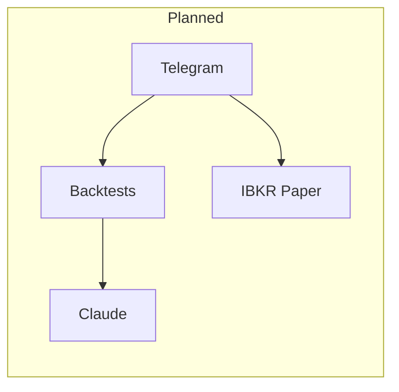

# Trading Lab — Stage 1 scaffold

Paper-only trading research lab: backtests, Claude-assisted analysis, IBKR paper execution, Telegram control.

See [.cursorrules](.cursorrules) for the full specification.

## Safety

This repository targets **Interactive Brokers paper accounts only**. Configuration rejects live gateway port `7496` and account IDs that do not start with `D`.

Full rules will live in `docs/SAFETY.md` as the project grows.

## Quick start (after later stages)

```bash
uv sync # installs the dev dependency-group (mypy, ruff, pytest, pandas-stubs)
cp .env.example .env
uv run pytest
uv run mypy src/trading_lab # avoid conda/global mypy missing deps & stubs
```

## Architecture



## License

TBD.
