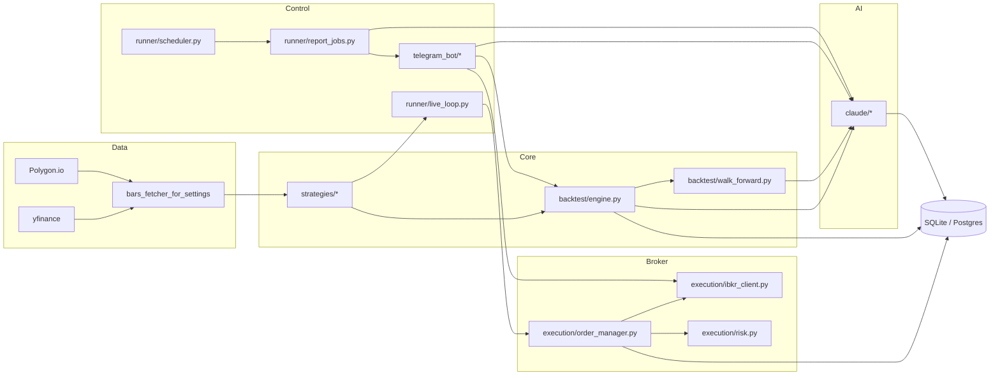
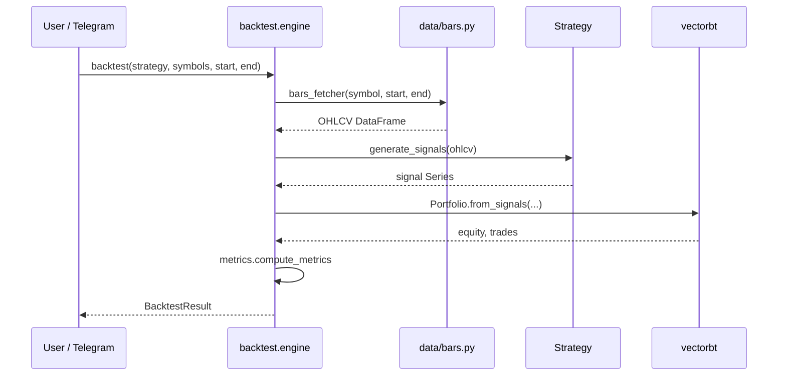
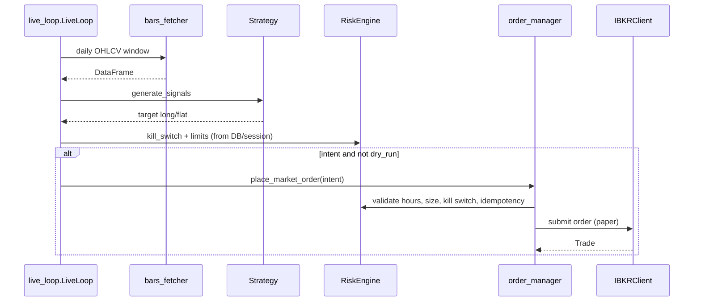
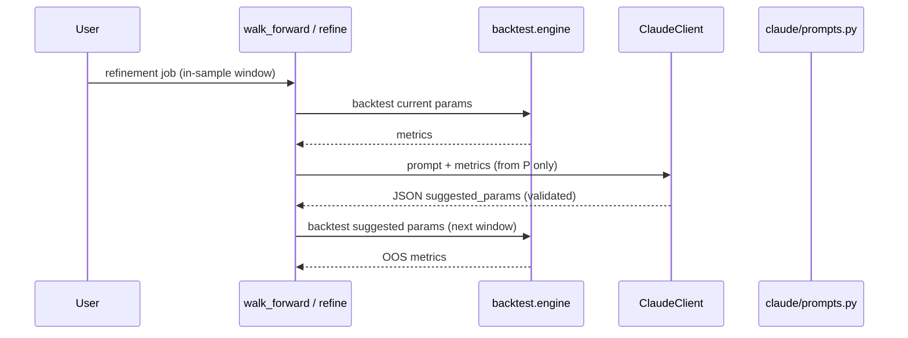
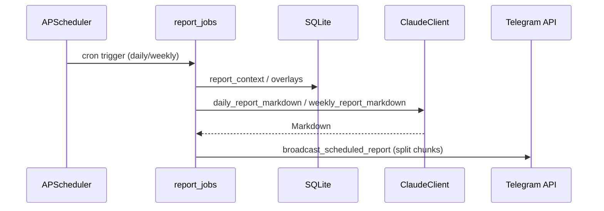

# Architecture

Design overview for the AI-assisted trading research lab: **deterministic strategies**, **vectorbt backtests**, optional **IBKR paper execution**, **Claude for analysis only**, and **Telegram** as the control plane.

## Goals

- Same strategy code drives backtests and (optional) paper execution.
- Claude never submits broker orders; it produces structured suggestions and narrative reports.
- SQLite holds audit rows (strategy runs, orders, Claude calls); schema is compatible with PostgreSQL via `DATABASE_URL`.

## Component map

## Sequence: backtest (CLI or Telegram)

## Sequence: live loop (paper)

## Sequence: Claude refinement (walk-forward)

## Sequence: scheduled reports

## Runnable entrypoints

| Script | Role |
|--------|------|
| `scripts/run_backtest.py` | Single-symbol backtest table |
| `scripts/run_walk_forward.py` | Rolling walk-forward |
| `scripts/run_paper_trading.py` | Async polling loop + IBKR paper |
| `scripts/run_telegram_bot.py` | Telegram command bot |
| `scripts/run_scheduled_reports.py` | APScheduler + Claude reports |

## Configuration highlights

- `DATA_PROVIDER=yfinance|polygon` selects historical/live bar fetcher (`src/trading_lab/data/bars.py`).
- `IBKR_ACCOUNT` may be empty for **backtest-only**; broker scripts call `Settings.paper_ibkr_account_id_required()`.
- Telegram live fills use `telegram_bot/notify.py` (HTTP `sendMessage`) when `TELEGRAM_LIVE_NOTIFY_ENABLED=true`.

See [SAFETY.md](SAFETY.md) for enforced trading guards.
